# Quimix

Laboratório virtual de química. O aluno ou o professor entra com conta JWT, monta uma mistura na bancada (pela tabela periódica ou por fórmula) e vê o produto no béquer — com volume, concentração, equação e, se a química for perigosa, a explicação do porquê.

Não é um jogo de explosões. O Quimix ensina o **produto real** da mistura. Explosão, chama, derretimento e gelo só aparecem quando a reação realmente exige. Pólvora no béquer é pólvora; TNT é um sólido; soda cáustica pronta não explode. Sódio metálico na água explode e vira hidróxido.

Este repositório é a **Fase 1** de um TCC: frontend React, três APIs FastAPI (gateway, auth, simulação) e Postgres orquestrados por Docker Compose.

---

## Sumário

1. [Visão geral: o que o sistema faz](#1-visão-geral-o-que-o-sistema-faz)
2. [O que usa (stack)](#2-o-que-usa-stack)
3. [Arquitetura e fluxogramas](#3-arquitetura-e-fluxogramas)
4. [Como o aluno usa o laboratório](#4-como-o-aluno-usa-o-laboratório)
5. [Como uma simulação funciona por dentro](#5-como-uma-simulação-funciona-por-dentro)
6. [Dois motores: visual no browser, números no servidor](#6-dois-motores-visual-no-browser-números-no-servidor)
7. [Identificação química (produto × efeito)](#7-identificação-química-produto--efeito)
8. [Parser de fórmulas e unidades](#8-parser-de-fórmulas-e-unidades)
9. [Autenticação JWT](#9-autenticação-jwt)
10. [API Gateway](#10-api-gateway)
11. [Auth Service](#11-auth-service)
12. [Simulation Service](#12-simulation-service)
13. [Frontend, tela a tela](#13-frontend-tela-a-tela)
14. [Béquer: animação e temas](#14-béquer-animação-e-temas)
15. [Banco de dados](#15-banco-de-dados)
16. [Contratos HTTP](#16-contratos-http)
17. [Segurança](#17-segurança)
18. [Infra Docker](#18-infra-docker)
19. [Como subir e desenvolver](#19-como-subir-e-desenvolver)
20. [Variáveis de ambiente](#20-variáveis-de-ambiente)
21. [Testes](#21-testes)
22. [Mapa de arquivos](#22-mapa-de-arquivos)
23. [Próximas fases](#23-próximas-fases)
24. [Autores](#24-autores)

---

## 1. Visão geral: o que o sistema faz

O Quimix resolve três problemas de aula:

1. **Misturar sem laboratório físico** — clicar em Na e Cl, ou digitar `NaCl`, e ver sal de cozinha.
2. **Registrar o raciocínio** — o backend devolve moles, volume total e logs; o frontend nomeia o composto e mostra a equação.
3. **Não mentir sobre o perigo** — o espetáculo visual só liga quando a química do contato é violenta, e sempre vem com texto didático.

Papéis de usuário: `aluno`, `professor`, `admin`. Só quem está autenticado executa experimento. Cadastro público não cria admin.

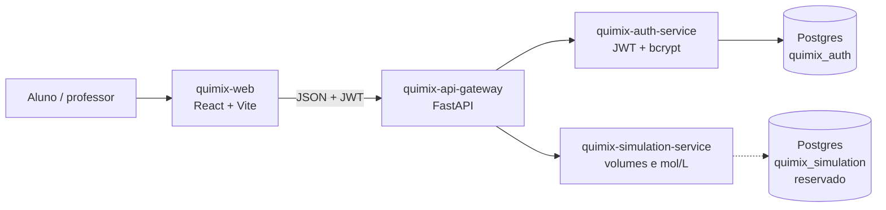

---

## 2. O que usa (stack)

Nada é “framework mágico”: cada peça tem um papel.

### Frontend (`quimix-web`)

| Peça | Versão / detalhe | Para que serve |
|------|------------------|----------------|
| React | 19 | UI da home, login, cadastro e bancada |
| React DOM | 19 | Render no `#root` |
| React Router | 7 | Rotas `/`, `/login`, `/register`, `/simulate` |
| TypeScript | ~5.8 | Tipos de usuário, mistura, fórmula, elemento |
| Vite | 6 | Dev server na 5173 e build |
| Vitest | 3 | Testes do parser, identificador e cliente HTTP |
| CSS próprio | `src/styles.css` | Temas do béquer, tabela periódica, auth |
| localStorage | chaves `quimix_*` | Access token, refresh token e usuário |
| Nginx | 1.27 (imagem Docker) | Serve o `dist` e faz fallback SPA (`try_files` → `index.html`) |
| Node | 22 Alpine (build Docker) | `npm install` + `npm run build` |

Variável de build: `VITE_API_BASE_URL` (padrão `http://localhost:8000`). O browser **sempre** fala com o gateway, nunca com as portas 8001/8002.

### APIs Python

| Peça | Versão | Onde entra |
|------|--------|------------|
| Python | 3.11+ local; **3.12-slim** nas imagens | Runtime |
| FastAPI | 0.115.12 | Rotas, OpenAPI em `/docs` e `/redoc` |
| Uvicorn | 0.34.0 | Servidor ASGI |
| Pydantic | 2.11.1 | Validação de body (e-mail, volume, senha) |
| pydantic-settings | 2.8.1 | Lê `.env` |
| httpx | 0.28.1 | Gateway faz proxy; testes usam TestClient |
| PyJWT | 2.10.1 | Assina e valida JWT HS256 |
| bcrypt | 4.3.0 | Hash da senha (auth) |
| SQLAlchemy | 2.0.39 | Tabela `users` (auth) |
| psycopg | 3.2.6 binary | Driver Postgres do auth no Compose |
| email-validator | 2.2.0 | `EmailStr` no cadastro/login |
| pytest | 8.3.5 | Suítes de cada serviço |
| pytest-asyncio | 0.25.3 | Testes async do gateway |

### Infra

| Peça | Detalhe |
|------|---------|
| Docker Compose | Sobe Postgres + 3 APIs + web |
| Postgres | 16 Alpine; porta **não** publicada no host |
| Volume | `quimix_pg_data` |
| Init SQL | Cria `quimix_auth`, `quimix_simulation`, `quimix_catalog`, `quimix_experiment`, `quimix_periodic` |

### O que cada serviço **não** usa

- Simulation **não** usa banco na Fase 1 (catálogo em memória).
- Gateway **não** tem banco; estado do rate limit é um `deque` por IP na RAM.
- Web **não** chama simulation/auth direto.
- Nenhum serviço fala MQTT/IoT. A simulação é HTTP puro.

---

## 3. Arquitetura e fluxogramas

### 3.1 Contexto do sistema

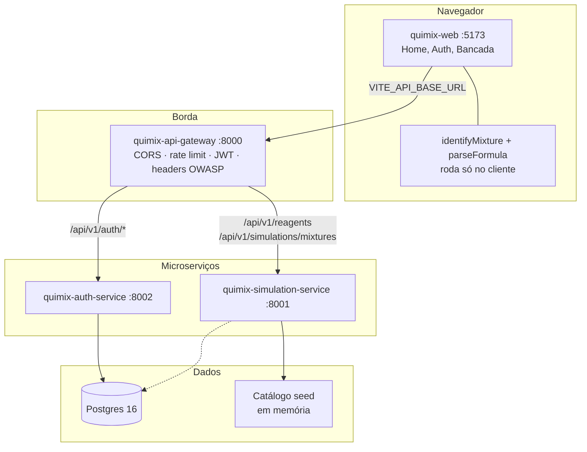

### 3.2 Camadas internas (Clean Architecture)

Cada API Python segue o mesmo corte. O domínio não importa FastAPI.

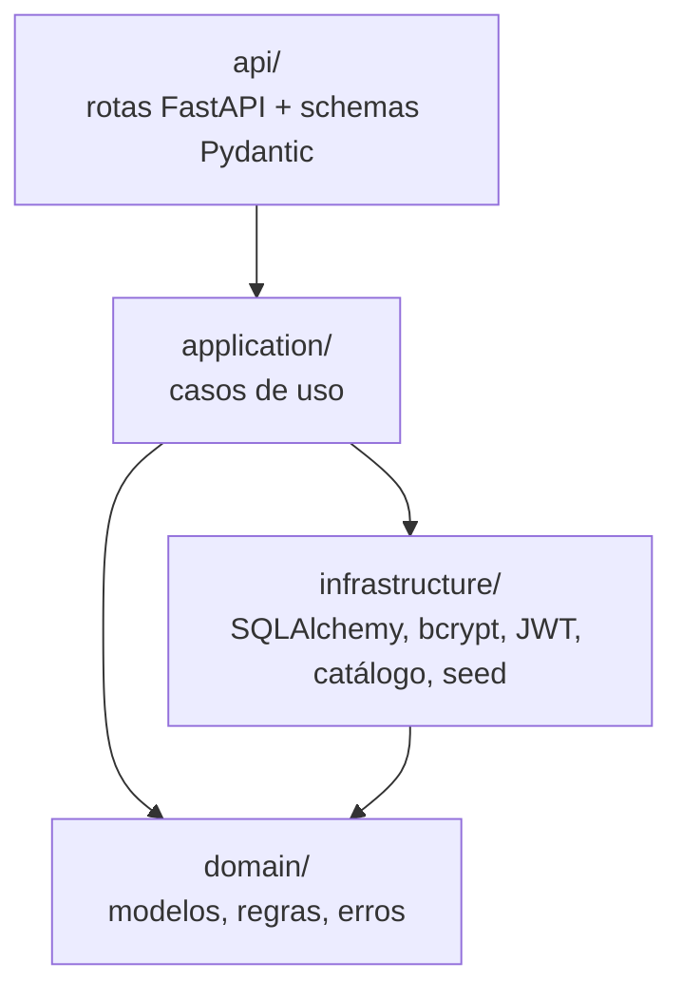

| Serviço | `domain` | `application` | `infrastructure` | `api` |
|---------|----------|---------------|------------------|-----|
| Auth | `User`, `Role`, `UserRepository` | `AuthService` (register/login/refresh/me) | `database.py`, `security.py`, `seed.py` | `routes.py`, `schemas.py` |
| Simulation | `Reagent`, `calculate_mixture` | `SimulateMixtureUseCase` | `reagent_catalog.py` | `routes.py`, `schemas.py` |
| Gateway | — | — | `proxy.py`, `auth.py`, `middleware.py` | `main.py` |

### 3.3 Subida do Compose (ordem real)

O Postgres só aceita conexões depois do healthcheck. Auth e simulation esperam isso. O gateway espera os dois. A web espera o gateway.

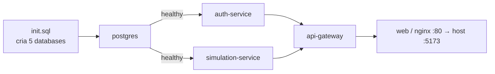

---

## 4. Como o aluno usa o laboratório

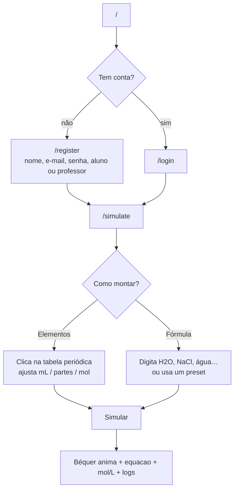

Guarda de rota: `RequireAuth`. Sem usuário no contexto, `/simulate` redireciona para `/login` e guarda `state.from` para voltar depois.

---

## 5. Como uma simulação funciona por dentro

Este é o fluxo completo, do clique até o béquer. O ponto importante: **o servidor não nomeia o composto**. Ele só faz conta de volume e concentração. O nome, a cor, a equação e o efeito nascem no TypeScript.

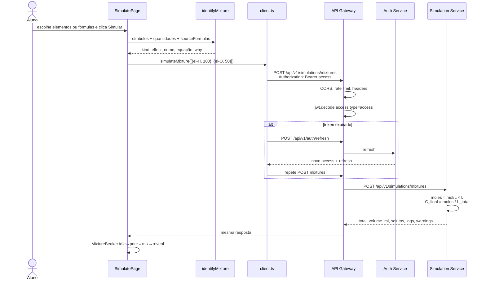

Exemplo numérico (modo fórmula, `H2O`, 100 mL):

1. Parser: H₂O → `{ H: 2, O: 1 }`.
2. Expansão em mL: soma estequiométrica = 3; H recebe `100 × 2/3`, O recebe `100 × 1/3`.
3. Identificador: chave `H+O`, proporção ~2:1 → água, `effect: none`.
4. Backend: dois reagentes `el-H` e `el-O` a 1 mol/L; volume total aditivo; concentrações resultantes.
5. Béquer: tema `theme-water`, sem cogumelo.

---

## 6. Dois motores: visual no browser, números no servidor

| Pergunta | Quem responde | Arquivo |
|----------|---------------|---------|
| Que composto é esse? | Frontend | `mixtureOutcomes.ts` → `identifyMixture` |
| Qual a equação? | Frontend | mesma receita |
| Explode / derrete / congela / inflama? | Frontend | `resolveEffect` |
| Por quê? (`why`) | Frontend | texto da receita |
| Qual o volume total? | Backend | `mixture.py` → `calculate_mixture` |
| Qual a concentração mol/L? | Backend | moles / litros |
| Logs de adição | Backend | uma linha por componente |
| “Não há modelagem de reação” | Backend, filtrado na UI | some quando o identificador já nomeou o produto |

Por isso pólvora **parece** pólvora mesmo o POST devolvendo só “K, N, O, C, S com tais mol/L”. O aviso genérico do servidor é escondido quando `kind !== "blend"`.

Conversão enviada ao backend (`amountToVolumeMl`):

| Unidade na UI | Fórmula | Interpretação |
|---------------|---------|---------------|
| mL | `amount` | volume direto |
| partes | `amount × 50` | cada parte vale 50 mL |
| mol | `amount × 1000` | catálogo a 1 mol/L ⇒ 1 mol ≈ 1000 mL |

Ids de reagente: `elementReagentId("Na")` → `el-Na`.

---

## 7. Identificação química (produto × efeito)

Arquivo: `quimix-web/src/data/mixtureOutcomes.ts`.

### 7.1 Dois eixos

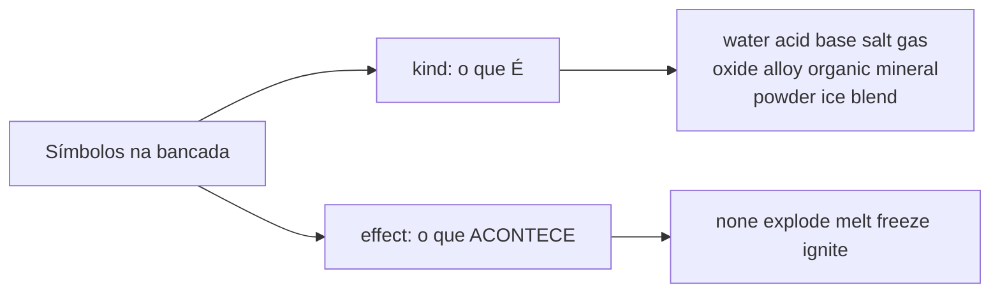

`kind` pinta o béquer (água azul, pó preto, gelo claro). `effect` dispara animação extra. Os dois são independentes: TNT é `powder` + `none`; nitroglicerina é `organic` + `explode`; HF é `acid` + `melt`.

### 7.2 Algoritmo

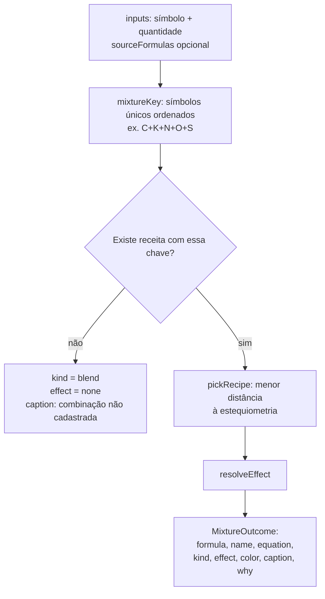

Distância de proporção: compara a fração de volume de cada símbolo com a fração estequiométrica. Empate próximo (≤ 0.04) prefere a receita mais específica da lista. É assim que H:O = 2:1 vira água e 1:1 vira H₂O₂; C:O = 1:1 vira CO e 1:2 vira CO₂.

### 7.3 Resolução do efeito

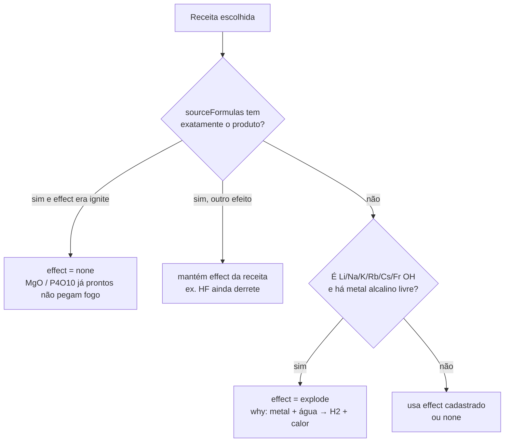

Consequências didáticas:

| Mistura | Produto | Efeito |
|---------|---------|--------|
| H + O ~ 2:1 | Água | nenhum |
| NaCl / fórmula `NaCl` | Sal de cozinha | nenhum |
| `KNO3CS`, `pólvora`, TNT, RDX, PETN, ANFO, termite | Pó | nenhum |
| Napalm | Orgânico (gel) | nenhum |
| Na (elemento) + água / H+O | Hidróxido | **explode** |
| Fórmula `NaOH` sozinha | Soda cáustica | nenhum |
| HF | Ácido fluorídrico | **derrete o vidro** |
| HCl, H₂SO₄ | Ácido | nenhum (não ataca sílica) |
| Nitroglicerina, XeO₃, XeO₄, Cl₂O₇ | composto instável | **explode** |
| PH₃, SiH₄, B₂H₆, formação de MgO/P₄O₁₀ | gás/óxido | **ignite** |
| Ba(OH)₂ + NH₄Cl | mistura endotérmica | **freeze** |

### 7.4 De onde vêm as receitas

1. **Geração iônica** — para cada metal da tabela (exceto não-cátions: H, C, N, O, halogênios, nobres, etc.) cria halogenetos, óxido, sulfeto, hidróxido, carbonato, sulfato, nitrato, fosfato… com a carga típica do grupo. Variantes extras: Fe²⁺, Cu⁺, Sn²⁺, Pb⁴⁺, etc.
2. **Receitas explícitas** — água, peróxido, ácidos, gases, orgânicos, minerais, ligas (latão, bronze, inox), pólvora, TNT, napalm, termite, ANFO, compostos de xenônio.
3. **SPECIAL** — nomes de aula (soda cáustica, ferrugem, leite de magnésia) e ignição na *formação* de MgO / P₄O₁₀.
4. **Aliases** — `polvora`, `polvora negra`, `gunpowder` → `KNO3CS`; `napalm` → `AlC8H18`.

`lookupCompound("água")` e `lookupCompound("H₂O")` encontram a mesma receita (normaliza acento, subscrito e pontuação).

Presets da barra de fórmula: `H2O`, `NaCl`, `HCl`, `NaOH`, `H2SO4`, `HNO3`, `CO2`, `CH4`, `NH3`, `H2O2`, `CaCO3`, `Fe2O3`, `C2H5OH`, `C6H12O6`, `KOH`.

---

## 8. Parser de fórmulas e unidades

Arquivo: `quimix-web/src/data/formula.ts`.

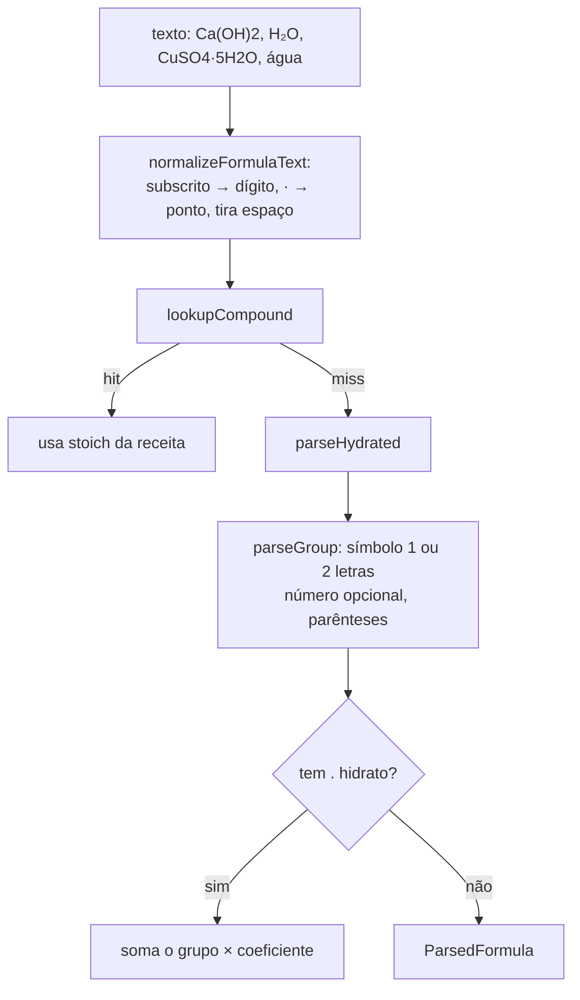

Aceita: `H2O`, `NaCl`, `Fe2O3`, `Ca(OH)2`, `CuSO4.5H2O` (também `·`, `*`). Rejeita parêntese solto e trecho que não é elemento da tabela (`KNOWN_SYMBOLS`).

`expandFormula`:

- em **mL**, reparte o volume pela soma dos índices (`H2O` em 100 mL → H 66,67 / O 33,33);
- em **partes** ou **mol**, multiplica cada índice pela quantidade (`1 mol de H2O` → 2 de H e 1 de O na conta interna).

Quantidade padrão: 50 mL por elemento, 100 mL por fórmula; `1` nas outras unidades.

---

## 9. Autenticação JWT

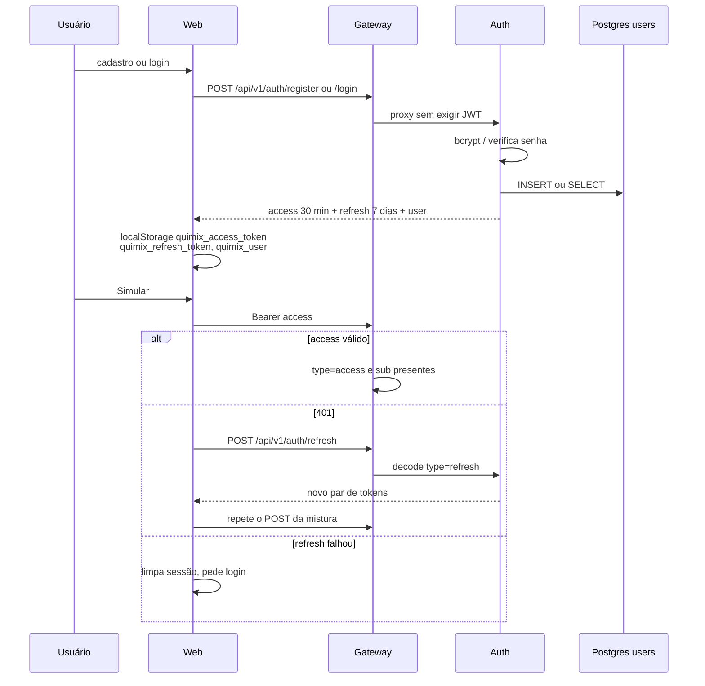

Claims:

| Token | `type` | Conteúdo | Vida |
|-------|--------|----------|------|
| Access | `access` | `sub` (id), `email`, `role`, `iat`, `exp` | 30 minutos |
| Refresh | `refresh` | `sub`, `iat`, `exp` | 7 dias |

Algoritmo HS256. **O mesmo `JWT_SECRET` no auth e no gateway.** Leeway de 60 s nos dois lados (relógio dos containers). Refresh bem-sucedido **rotaciona** o par: devolve access novo e refresh novo.

Papéis:

- Cadastro: só `aluno` ou `professor`. `admin` no body → `400` “Cadastro público como admin não é permitido.”
- Seed opcional na subida: `admin@example.com` / `Admin@12345` / papel `admin`, se `SEED_ADMIN_ENABLED=true` e o e-mail ainda não existe.
- Usuário `is_active=false` não autentica.

Senha: bcrypt (`bcrypt.hashpw` / `checkpw`), mínimo 8 caracteres, máximo 128. E-mail normalizado em minúsculas, único.

Sessão no cliente (`src/api/client.ts`):

- `authorizedFetch` manda Bearer; se a resposta é 401, chama `refreshSession` (uma promise compartilhada, sem tempestade de refresh) e tenta de novo.
- Eventos `quimix-session-expired` e `quimix-session-refreshed` atualizam o `AuthContext` sem recarregar a página.
- No boot, se há usuário no storage, `GET /api/v1/auth/me`; se falhar, tenta refresh.

---

## 10. API Gateway

Única porta que o frontend conhece (`:8000`). Não calcula mistura e não grava usuário. Só filtra, autentica e encaminha.

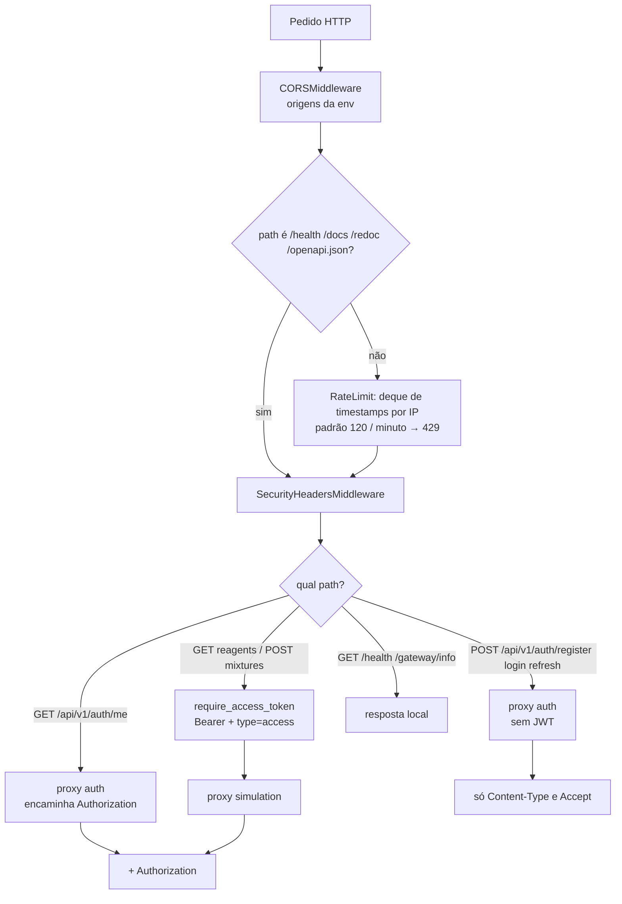

Allowlist anti-SSRF: o gateway **não** aceita um path arbitrário para “buscar qualquer URL”. Só estes destinos:

| Método e path | Destino |
|---------------|---------|
| POST `/api/v1/auth/register` | auth `:8002` |
| POST `/api/v1/auth/login` | auth |
| POST `/api/v1/auth/refresh` | auth |
| GET `/api/v1/auth/me` | auth |
| GET `/api/v1/reagents` | simulation `:8001` |
| POST `/api/v1/simulations/mixtures` | simulation |
| GET `/health`, GET `/api/v1/gateway/info` | o próprio gateway |

Headers OWASP em **toda** resposta:

- `X-Content-Type-Options: nosniff`
- `X-Frame-Options: DENY`
- `Referrer-Policy: no-referrer`
- `Content-Security-Policy: default-src 'none'; frame-ancestors 'none'`
- `Permissions-Policy: geolocation=(), microphone=(), camera=()`

Proxy: httpx timeout 30 s; falha de rede → `502`. Método fora da allowlist → `404`. CORS sem cookies (`allow_credentials=False`).

---

## 11. Auth Service

Porta `8002`. Persistência em `quimix_auth.users`.

Na subida (`app/main.py`): `init_db()` → `create_all` da tabela; `seed_admin_user()` se o seed estiver ligado.

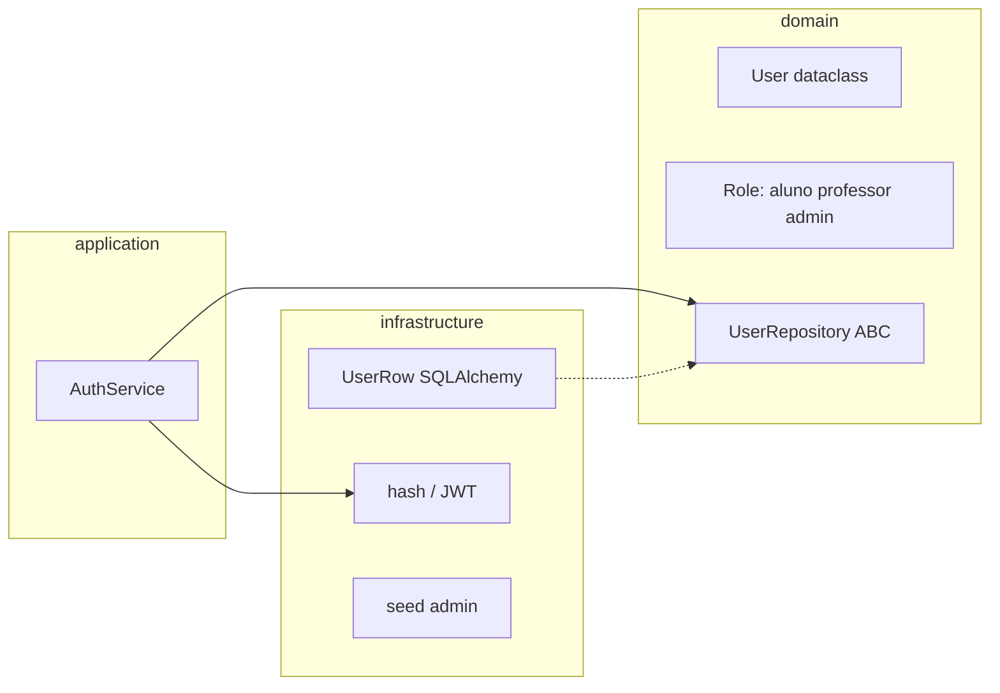

Tabela `users`: `id` CHAR 36, `email` único, `full_name`, `role`, `password_hash`, `created_at` timezone, `is_active`.

Rotas (`/api/v1/auth`):

| Método | Path | Entrada | Saída |
|--------|------|---------|-------|
| POST | `/register` | e-mail, senha ≥ 8, nome 2–120, role | `201` tokens + user |
| POST | `/login` | e-mail, senha | `200` tokens + user |
| POST | `/refresh` | `{ refresh_token }` | novo par + user |
| GET | `/me` | header Bearer access | user |
| GET | `/health` | — | `{ status, service }` |

Erros: e-mail duplicado `409`; senha curta / admin público `400`; login ruim / token inválido `401`.

Dev isolado sem Docker: `DATABASE_URL=sqlite:///./quimix_auth.db`.

---

## 12. Simulation Service

Porta `8001`. **Não modela reação química e não fala com IoT.** Só misturas volumétricas.

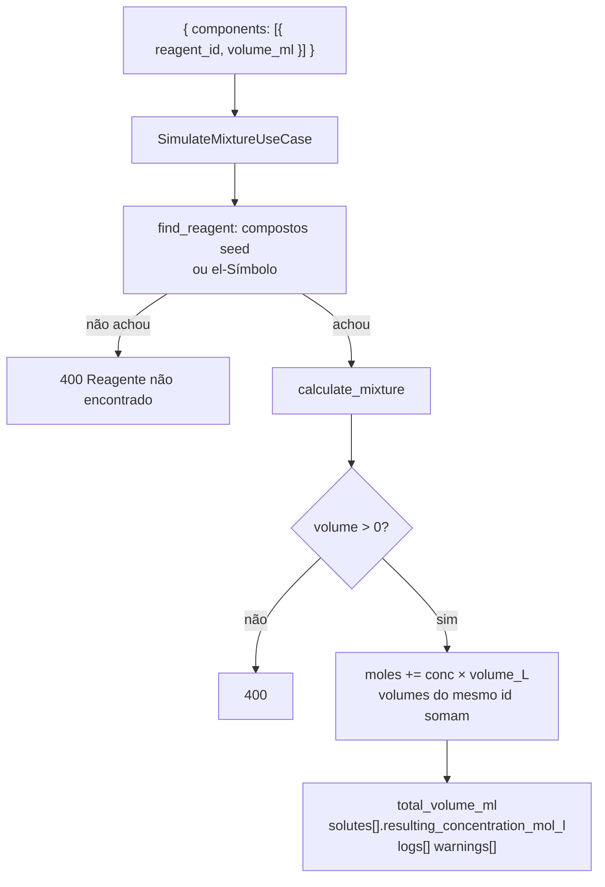

Conta:

```
moles_i     = concentração_i (mol/L) × (volume_i_mL / 1000)
V_total_mL  = soma dos volumes
C_i_final   = moles_i / (V_total_mL / 1000)   → 6 casas
```

Se há mais de um `reagent_id` distinto, entra o warning de que os volumes são aditivos e **não há modelagem de reação**. A UI esconde essa frase quando o identificador já reconheceu um composto.

Catálogo seed:

- Compostos: `hcl-1m` (HCl 1 mol/L), `naoh-1m` (NaOH 1 mol/L), `water` (H₂O 0 mol/L).
- Elementos `el-H`, `el-Na`, … com 1.0 mol/L (nobres e alguns pesados em 0.5). Símbolo desconhecido com id `el-Xx` ainda simula a 1.0 mol/L.

A bancada manda só `el-{símbolo}`. Os compostos seed existem para chamada direta na OpenAPI.

Validação Pydantic: 1 a 50 componentes, `volume_ml` > 0 e ≤ 100 000.

---

## 13. Frontend, tela a tela

Entrada: `src/main.tsx` → `StrictMode` + `BrowserRouter` + `App` + `styles.css`.

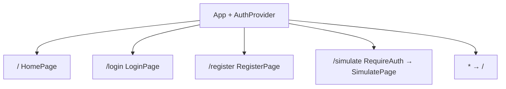

### Home (`HomePage`)

Atmosfera (`LabAtmosphere`), marca (`QuimixMark`: um béquer rachado com flash, anéis e estilhaços), título, CTA “Entrar para simular” ou “Iniciar simulação”, três cards: misturas visuais, tabela periódica viva, raciocínio registrado.

### Login / cadastro

Mesmo painel visual. Cadastro escolhe perfil **Aluno** ou **Professor**. Depois do sucesso: navega para `/simulate` (login respeita `location.state.from`).

### Bancada (`SimulatePage`)

Duas colunas: `bench-panel` (form) e `result-panel` (béquer + números).

Toolbar:

- Abas **Elementos** / **Fórmula** (`role="tablist"`). Trocar o modo zera a bandeja.
- Unidades **mL** / **partes** / **mol** (`role="radiogroup"`). Trocar a unidade reseta as quantidades para o default.

Modo elementos: clique na célula adiciona/remove chip (símbolo colorido, nome, input de quantidade, ×).

Modo fórmula: input + Adicionar + presets; a tabela periódica fica `interactive={false}` (classe `is-locked`) só para ver os átomos do composto. Cada chip mostra fórmula bonita (`H₂O`), nome e linha estequiométrica (`2 H + O`).

Ações: Limpar, Simular (disabled sem item ou enquanto `submitting`).

Resultado após o POST: volume equivalente, nota da unidade, lista de solutos mol/L, warnings filtrados, `<ol>` de logs. `sceneId` incrementa para remountar o béquer a cada simulação.

### Tabela periódica (`PeriodicTable` + `periodicTable.ts`)

118 elementos. Grade 7 períodos × 18 grupos; lantanídeos e actinídeos numa série abaixo. Cada célula: número Z, símbolo, nome em português. Cores por categoria (alcalinos, transições, halogênios, nobres, …). `ELEMENT_BY_SYMBOL` resolve o átomo na expansão da fórmula.

---

## 14. Béquer: animação e temas

`MixtureBeaker` identifica de novo a mistura (com `sourceFormulas`) e encena.

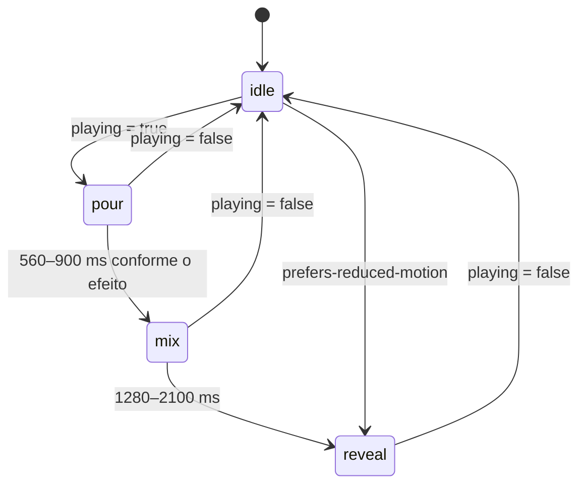

Tempos: explosão é a mais curta (impacto); ignição no meio; melt/freeze um pouco mais longos; mistura “calma” (água, sal) leva ~2,1 s até revelar.

Classes CSS: `theme-{kind}` + `effect-{effect}` + `is-idle|is-pour|is-mix|is-reveal`.

| Efeito / kind | O que o CSS/SVG faz |
|---------------|---------------------|
| `effect-explode` | Flash, onda de choque, fogo, cogumelo de fumaça, estilhaços |
| `effect-ignite` | Chamas e brasas |
| `effect-melt` | Rachaduras no vidro (escopadas ao béquer, não à página) |
| `effect-freeze` / `theme-ice` | Geada |
| `theme-powder` | Grãos escuros |
| `theme-water` / `gas` / `salt` / `alloy` / `organic` | glifo + cor `--product` |

Gotas coloridas caem na fase `pour` (até 4 símbolos). Abaixo do frasco: status (“Os elementos caem…”, “A reação ficou violenta…”) e, se houver `why`, a caixa de explicação.

Variáveis CSS injetadas: `--mix-a`, `--mix-b` (cores dos primeiros elementos) e `--product` (cor da receita).

---

## 15. Banco de dados

Um cluster, vários databases (`quimix-infra/docker/postgres/init.sql`):

| Database | Fase 1 |
|----------|--------|
| `quimix_auth` | Tabela `users` em uso |
| `quimix_simulation` | Reservado (cálculo ainda é stateless) |
| `quimix_catalog` | Próxima fase |
| `quimix_experiment` | Próxima fase |
| `quimix_periodic` | Próxima fase |

O container **não** mapeia `5432:5432`, para não brigar com Postgres instalado na máquina. Healthcheck: `pg_isready`. Volume: `quimix_pg_data`.

Auth no Compose: `postgresql+psycopg://quimix:…@postgres:5432/quimix_auth`.

---

## 16. Contratos HTTP

Base: `http://localhost:8000`. OpenAPI: `/docs` em cada serviço (8000, 8001, 8002).

### Cadastro

```http
POST /api/v1/auth/register
Content-Type: application/json

{
  "email": "aluno@escola.edu",
  "password": "senha1234",
  "full_name": "Ana Aluna",
  "role": "aluno"
}
```

`201`:

```json
{
  "access_token": "<jwt>",
  "refresh_token": "<jwt>",
  "token_type": "bearer",
  "user": {
    "id": "<uuid>",
    "email": "aluno@escola.edu",
    "full_name": "Ana Aluna",
    "role": "aluno"
  }
}
```

### Login (conta seed)

```http
POST /api/v1/auth/login
Content-Type: application/json

{ "email": "admin@example.com", "password": "Admin@12345" }
```

### Quem sou eu

```http
GET /api/v1/auth/me
Authorization: Bearer <access>
```

### Mistura

```http
POST /api/v1/simulations/mixtures
Authorization: Bearer <access>
Content-Type: application/json

{
  "components": [
    { "reagent_id": "el-H", "volume_ml": 66.67 },
    { "reagent_id": "el-O", "volume_ml": 33.33 }
  ]
}
```

`200`: `total_volume_ml`, `solutes[]` (`reagent_id`, `name`, `formula`, `resulting_concentration_mol_l`, `contributed_volume_ml`), `logs[]`, `warnings[]`.

Sem Bearer: `401` “Login obrigatório para executar experimentos.”

`GET /api/v1/reagents` — lista seed (também exige JWT no gateway).

`GET /api/v1/gateway/info` — nome, versão e URLs internas de simulation/auth.

---

## 17. Segurança

Detalhe em `quimix-infra/docs/security.md`.

| Risco OWASP | No Quimix |
|-------------|-----------|
| Broken Access Control | Experimento só com JWT; admin não se cadastra sozinho |
| Cryptographic Failures | bcrypt; secret no `.env`; access curto |
| Injection | Pydantic + SQLAlchemy parametrizado |
| Insecure Design | Três serviços; validação na borda e no domínio |
| Security Misconfiguration | Headers no gateway |
| Identification / Auth Failures | Access + refresh rotacionado |
| SSRF | Allowlist de path e host interno |
| Logging | Sem senha/token nos logs |

Em produção: trocar `POSTGRES_PASSWORD`, `JWT_SECRET` (≥ 32 caracteres) e desligar `SEED_ADMIN_ENABLED`. HTTPS fica para o deploy, não para o Compose local.

---

## 18. Infra Docker

`quimix-infra/docker-compose.yml`:

| Serviço Compose | Imagem / build | Porta no host | Env principal |
|-----------------|----------------|---------------|---------------|
| `postgres` | postgres:16-alpine | nenhuma (só `expose 5432`) | user/senha/db |
| `simulation-service` | `../quimix-simulation-service` Python 3.12 | 8001 | `DATABASE_URL` asyncpg (reservado) |
| `auth-service` | `../quimix-auth-service` Python 3.12 | 8002 | Postgres + JWT + seed |
| `api-gateway` | `../quimix-api-gateway` Python 3.12 | 8000 | CORS, rate limit, URLs internas, JWT |
| `web` | Node 22 build → nginx 1.27 | 5173→80 | `VITE_API_BASE_URL=http://localhost:8000` no **build** |

A web precisa de `localhost:8000` (visão do browser), não `http://api-gateway:8000` (visão Docker). Por isso o ARG é host-localhost mesmo dentro do Compose.

Nginx da web: `try_files $uri $uri/ /index.html` para o React Router não 404 em `/simulate`.

---

## 19. Como subir e desenvolver

### Ambiente completo

```bash
cd quimix-infra
cp .env.example .env
docker compose up --build
```

| O quê | URL |
|-------|-----|
| Laboratório | http://localhost:5173 |
| Gateway / OpenAPI | http://localhost:8000/docs |
| Simulation / OpenAPI | http://localhost:8001/docs |
| Auth / OpenAPI | http://localhost:8002/docs |

Parar: `docker compose down`. Volume do Postgres permanece até `docker compose down -v`.

### Serviços um a um (hot reload)

Auth `8002`:

```bash
cd quimix-auth-service
python -m venv .venv
pip install -e ".[dev]"
uvicorn app.main:app --reload --port 8002
```

Simulation `8001`:

```bash
cd quimix-simulation-service
python -m venv .venv
pip install -e ".[dev]"
uvicorn app.main:app --reload --port 8001
```

Gateway `8000` (aponta para localhost:8001 e :8002):

```bash
cd quimix-api-gateway
python -m venv .venv
pip install -e ".[dev]"
uvicorn app.main:app --reload --port 8000
```

Web `5173`:

```bash
cd quimix-web
npm install
npm run dev
```

| Script web | Função |
|------------|--------|
| `npm run dev` | Vite, host `true`, porta 5173 |
| `npm run build` | `tsc -b` + Vite production |
| `npm run preview` | serve o `dist` |
| `npm test` | Vitest uma passada |

---

## 20. Variáveis de ambiente

Copiar `quimix-infra/.env.example` → `.env`. **Não versionar `.env`.**

| Variável | Padrão | Quem lê |
|----------|--------|---------|
| `POSTGRES_USER` | `quimix` | Postgres, URLs dos serviços |
| `POSTGRES_PASSWORD` | `quimix_dev_change_me` | idem |
| `POSTGRES_DB` | `quimix` | banco inicial do container |
| `GATEWAY_PORT` | `8000` | publish |
| `SIMULATION_PORT` | `8001` | publish |
| `AUTH_PORT` | `8002` | publish |
| `WEB_PORT` | `5173` | publish nginx |
| `CORS_ORIGINS` | `http://localhost:5173` | gateway (lista com vírgula) |
| `RATE_LIMIT_PER_MINUTE` | `120` | gateway |
| `JWT_SECRET` | string de dev | **auth e gateway iguais** |
| `SEED_ADMIN_ENABLED` | `true` | auth |
| `SEED_ADMIN_EMAIL` | `admin@example.com` | auth |
| `SEED_ADMIN_PASSWORD` | `Admin@12345` | auth |
| `SEED_ADMIN_NAME` | `Admin Quimix` | auth |
| `SIMULATION_SERVICE_URL` | `http://simulation-service:8001` | gateway no Compose |
| `AUTH_SERVICE_URL` | `http://auth-service:8002` | gateway no Compose |

Auth extra: `DATABASE_URL`, `JWT_ALGORITHM=HS256`, `ACCESS_TOKEN_MINUTES=30`, `REFRESH_TOKEN_DAYS=7`.

Web extra: `VITE_API_BASE_URL` (build-time).

---

## 21. Testes

Plano em `quimix-infra/docs/test-plan.md`. Cada pasta é isolada.

```bash
cd quimix-auth-service && python -m pytest -q
cd quimix-simulation-service && python -m pytest -q
cd quimix-api-gateway && python -m pytest -q
cd quimix-web && npm test
```

| Arquivo | O que prova |
|---------|-------------|
| `quimix-auth-service/tests/unit/test_security.py` | bcrypt e JWT access ≠ refresh |
| `quimix-auth-service/tests/integration/test_auth_api.py` | register, login, me, 409 duplicado, bloqueio de admin |
| `quimix-simulation-service/tests/unit/test_mixture.py` | moles, volume aditivo, volume inválido |
| `quimix-simulation-service/tests/integration/test_api.py` | HTTP de reagentes e misturas |
| `quimix-api-gateway/tests/test_gateway.py` | proxy, 401, headers, rate limit |
| `quimix-web/src/data/formula.test.ts` | parser, hidrato, unidades |
| `quimix-web/src/data/mixtureOutcomes.test.ts` | água, CO/CO₂, pólvora como pó, HF melt, H₂SO₄ sem melt, Na+água explode, NaOH fonte sem explode, napalm orgânico |
| `quimix-web/src/api/client.test.ts` | `formatConcentration` e retry após refresh |

Aceite auth: aluno/professor cadastram; login devolve access+refresh; `/me` exige Bearer; o gateway expõe as rotas de auth.

---

## 22. Mapa de arquivos

```
Quimix/
├── README.md
├── quimix-infra/
│   ├── docker-compose.yml
│   ├── .env.example
│   ├── docker/postgres/init.sql
│   └── docs/architecture.md, security.md, test-plan.md
├── quimix-api-gateway/
│   ├── app/main.py, config.py, proxy.py, auth.py, middleware.py
│   ├── tests/test_gateway.py
│   └── Dockerfile
├── quimix-auth-service/
│   ├── app/domain/models.py, repositories.py
│   ├── app/application/auth_service.py
│   ├── app/infrastructure/database.py, security.py, seed.py
│   ├── app/api/routes.py, schemas.py
│   ├── tests/unit, tests/integration
│   └── Dockerfile
├── quimix-simulation-service/
│   ├── app/domain/mixture.py, models.py
│   ├── app/application/simulate_mixture.py
│   ├── app/infrastructure/reagent_catalog.py
│   ├── app/api/routes.py, schemas.py
│   ├── tests/unit, tests/integration
│   └── Dockerfile
└── quimix-web/
    ├── src/main.tsx, App.tsx, styles.css
    ├── src/pages/HomePage, LoginPage, RegisterPage, SimulatePage
    ├── src/components/MixtureBeaker, PeriodicTable, QuimixMark, LabAtmosphere
    ├── src/data/mixtureOutcomes.ts, formula.ts, periodicTable.ts
    ├── src/api/client.ts
    ├── src/auth/AuthContext.tsx, RequireAuth.tsx
    ├── nginx.conf, Dockerfile, vite.config.ts
    └── testes *.test.ts ao lado do código
```

Documentação extra por pasta: `quimix-web/README.md`, `quimix-auth-service/README.md`, `quimix-api-gateway/README.md`, `quimix-simulation-service/README.md`, `quimix-infra/README.md`.

---

## 23. Próximas fases

Já há database vazio no Postgres para:

- catálogo persistente de reagentes (hoje o seed vive no simulation);
- histórico de experimentos por usuário;
- serviço da tabela periódica.

Fora isso, no deploy: HTTPS, secrets reais, autorização por turma/papel além do JWT binário “tem token / não tem”.

---

## 24. Autores

- **Luana Zenha**
- **Bruno Barral**
